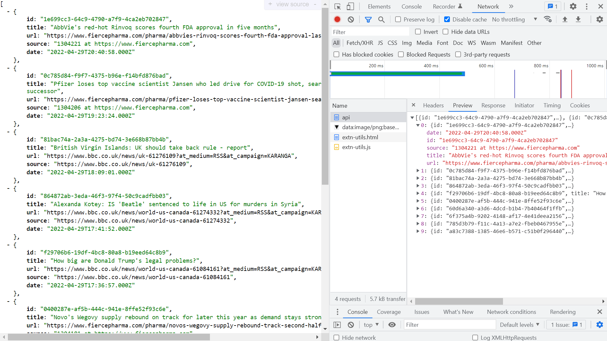

# :zap: Node CRON PostgreSQL

* Node.js + Express used with the [node-cron module](https://www.npmjs.com/package/node-cron) to fetch RSS feed data in XML format and interract with a web-based PostgreSQL database
* **Note:** to open web links in a new window use: _ctrl+click on link_


## :page_facing_up: Table of contents

* [:zap: Node CRON PostgreSQL](#zap-node-cron-postgresql)
  * [:page\_facing\_up: Table of contents](#page_facing_up-table-of-contents)
  * [:books: General info](#books-general-info)
  * [:camera: Screenshots](#camera-screenshots)
  * [:signal\_strength: Technologies](#signal_strength-technologies)
  * [:floppy\_disk: Setup](#floppy_disk-setup)
  * [:wrench: Testing](#wrench-testing)
  * [:computer: Code Examples](#computer-code-examples)
  * [:cool: Features](#cool-features)
  * [:clipboard: Status, Testing \& To-Do List](#clipboard-status-testing--to-do-list)
  * [:clap: Inspiration](#clap-inspiration)
  * [:file\_folder: License](#file_folder-license)
  * [:envelope: Contact](#envelope-contact)

## :books: General info

* An RSS (Really Simple Syndication) feed is coded in XML (Extensible Markup Language) with stripped-down content so is quicker to load.
* RSS parser used to convert XML to JS object

## :camera: Screenshots



## :signal_strength: Technologies

* [Node.js v18](https://nodejs.org/) Javascript runtime using the [Chrome V8 engine](https://v8.dev/)
* [Express v4](https://www.npmjs.com/package/express) web framework for node
* [node-cron v3](https://www.npmjs.com/package/node-cron) tiny task scheduler in pure JavaScript for node.js based on GNU crontab, to schedule a task in node.js using full crontab syntax.
* [config v3](https://www.npmjs.com/package/config) to organize hierarchical configurations for app deployment
* [rss-parser v3](https://www.npmjs.com/package/rss-parser) to convert RSS feed to JS object
* [uuid v9](https://www.npmjs.com/package/uuid) to create version 4 (random) RFC4122 UUIDs

## :floppy_disk: Setup

* `npm i` to install dependencies
* Create `.env` and add database credentials - see `.env.example`
* `npm run dev` runs app in the development mode with auto-restart.
* Open [http://localhost:3000](http://localhost:3000) to view it in the browser: `/api` to view supabase data, `/api/cron` to view cron data from XML feed that is not already in the supabase database

## :wrench: Testing

* tba

## :computer: Code Examples

* `supabase.service.ts` supabase client access function that can be imported into other files for supabase operations

```typescript
import { createClient } from "@supabase/supabase-js";
import config from "config";

const dbUrl = config.get<string>("dbUrl");
const dbKey = config.get<string>("dbKey");

const supabase = createClient(dbUrl, dbKey);

export default supabase;
```

## :cool: Features

* tba

## :clipboard: Status, Testing & To-Do List

* Status: Working
* To-Do: Add other RSS feeds with separate database storage. Add frontend?

## :clap: Inspiration

* [node-cron documentation](https://nodecron.com/docs/)
* [LogRocket: Organizing your Express.js project structure for better productivity](https://blog.logrocket.com/organizing-express-js-project-structure-better-productivity/)
* [Joseph Mawa: How to Schedule a Job in Node Using node-cron](https://www.freecodecamp.org/news/schedule-a-job-in-node-with-nodecron/)
* [BusinessInsider: A guide to using RSS feeds, the files that contain real-time updates from websites](https://www.businessinsider.com/what-is-rss-feed)
* [Fierce Pharm RSS Feeds](https://www.fiercepharma.com/fiercepharmacom/rss-feeds)

## :file_folder: License

* This project is licensed under the terms of the MIT license.

## :envelope: Contact

* Repo created by [ABateman](https://github.com/AndrewJBateman), email: `gomezbateman@yahoo.com`
